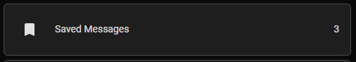
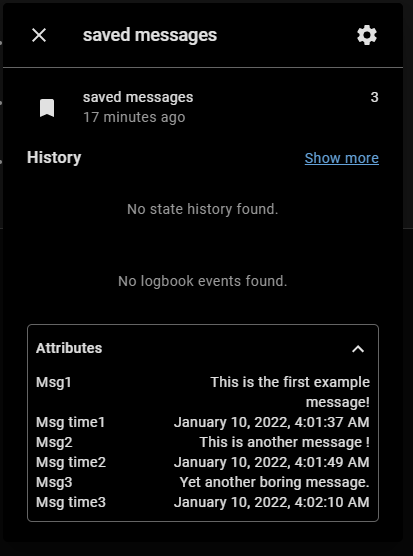
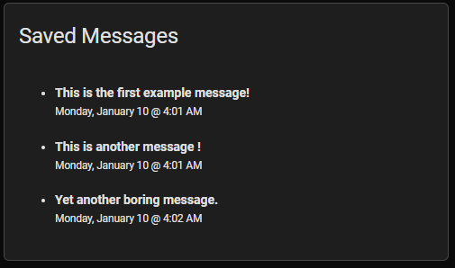
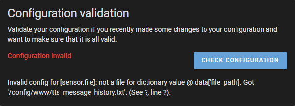

# Play and Save TTS Messages + Message History

## What is this?
This is more or less an answering machine (remember those?) for your TTS messages.  When you play a TTS message that you want saved under certain conditions (ie. nobody is home), you will call the script **Play or Save TTS Message** `script.play_or_save_message` instead of calling your tts service (or Alexa notify) directly.  The script will decide whether to play the message immediately, or save it based on the conditions you specify.  If a saved tts message is repeated another message is not saved, only the timestamp is updated to the most recent instance.

Messages are played back using the **Play Saved TTS Messages** script `script.play_saved_tts_messages`.  Set an appropriate trigger (for example when you arrive home) in the automation  **Play Saved Messages** `automation.play_saved_messages` automation to call this script automatically.

Saved messages will survive restarts.

**BONUS - OPTIONAL TTS MESSAGE HISTORY**

This default components in this package will also record messages to the file `/config/www/tts_message_history.txt` using the built in [file integration](https://www.home-assistant.io/integrations/file/).

**You must manually create a blank file `/config/www/tts_message_history.txt` and restart Home Assistant after installing this package for tts message history to function.**  The tts_message_history.txt file can also be *cleared* at any time, **but not deleted**. Note that it takes a moment for the last message to be recorded in the history file.

If you don't want to use message history just delete the indicated sections of code.

## How do I use it?
### Install This Package
The easiest way to utilize this is to install it as a [package](https://www.home-assistant.io/docs/configuration/packages/).

To enable packages in your configuration, create a folder in your config directory named `packages` and add the following line to your `configuration.yaml` file.

    homeassistant:
      packages: /config/packages

If you already have packages enabled in your configuration, simply download [package_save_tts_messages.yaml](package_save_tts_messages.yaml) to your packages directory.  Don't forget to restart Home Assistant!

### Install Without Packages
To utilize this without installing as a package copy the relevant code and paste in an appropriate place in your `configuration.yaml` file.  Everything except the **Play Saved Messages** automation and indicated TTS History components are required for Play and Save TTS Messages to function.

### Install HASS-Variables Custom Integration
The [HASS-Variables](https://github.com/Wibias/hass-variables) integration is available on HACS. If you're not using HACS I'll assume you know how to install it manually.

### Adjust Package For Your Configuration
You must change a couple of things in the package to work with your configuration.  **Look for the #TODO tags!**

- **TTS Service** - The package default is `tts.cloud_say` which is the NabuCasa TTS service.  Change these calls to whichever TTS service you use (TTS, Alexa Notify).
- **Media Player** - You must change these to a valid media player entity id in your configuration.
- **Play or Save Condition** - Adjust this condition to decide whether to play or save the TTS message.  The TTS message will play immediately and will not be saved when the condition(s) evaluate to true.
- **Play Saved Messages Trigger** - Adjust this trigger to automatically call **Play Saved TTS Messages**.  You can, of course, call this script directly anytime from a tap action etc.
- **TTS Message Timeout** - Adjust this for the longest TTS message you may play or your messages may be cut short.  Default is 60 seconds.

### Create or Adjust your TTS Service Calls
Finally, you must create the **Play or Save TTS Message** service calls.  Replace any current direct TTS service calls for messages you want to save or create new ones.

**BASIC TTS EXAMPLE**

    - service: tts.cloud_say
      target:
        entity_id: media_player.dining_room_hub
      data:
        message: ...

becomes

    - service: script.play_or_save_message
      data:
        message: ...

**ALEXA NOTIFY EXAMPLE**

In the package, you'll be replacing instance of this.

    service: tts.cloud_say
    target:
      entity_id: media_player.dining_room_hub
      data:
        message: ...

With something like this.

    service: notify.alexa_dining_room_hub
    data:
      data:
        type: tts
      message: ...

Don't forget to add the tts data tag when you replace the tts service calls!

**TTS MESSAGE HISTORY**
You must change **all** of your TTS service calls to `script.play_or_save_message` if you want them all included in your TTS message history file.

The `skip_save: true` parameter can be used if you want to record a messages in the history but not save them.

    - service: tts.play_or_save_message
      target:
        entity_id: media_player.dining_room_hub
      data:
        skip_save: true
        message: ...

### Skip No Messages Notification
The default configuration will play *"There are no messages waiting for you."* if there are no saved messages when  **Play Saved TTS Messages** is called.  If you wish to skip this message you can specify the `skip_none` parameter in a  **Play or Save TTS Message** service call.

    - service: script.play_or_save_message
      data:
        skip_none: true
        message: "This is my message!"

You can also change the default so the message is not played unless `skip_none` is set to `false`.

Change

    skip_none: '{{ skip_none|default(true) }}'

to

    skip_none: '{{ skip_none|default(false) }}'

Then call with `skip_none` set to `false` if you want the no saved messages message to play.

    - service: script.play_or_save_message
      data:
        message: "This is my message!"
        skip_none: false

### Clearing Saved Messages
Saved messages can be cleared without playing by calling the **Clear Saved Messages** `script.clear_saved_messages` script.  This can be used if you want to just display saved messages on the front end instead of playing them back via TTS (see markdown card example).

## Lovelace Examples
Using `variable.saved_messages` in an entity card will display the number of saved messages as the state.

See [saved_messages_entities_card.yaml](saved_messages_entities_card.yaml) for the sample entities card

You can view the messages in the more-info dialogue in the attributes drop down.

See [saved_messages_markdown_card.yaml](saved_messages_markdown_card.yaml) for the sample markdown card.

## Troubleshooting

If you see this error you forgot to create `/config/www/tts_message_history.txt`

NOTE - You will see this warning in your Home Assistant Log until the first TTS message is recorded in the history file.

`WARNING (SyncWorker_16) [homeassistant.components.file.sensor] File or data not present at the moment: tts_message_history.txt`
