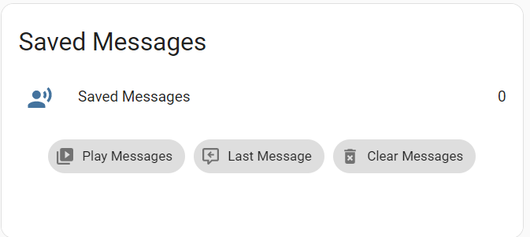
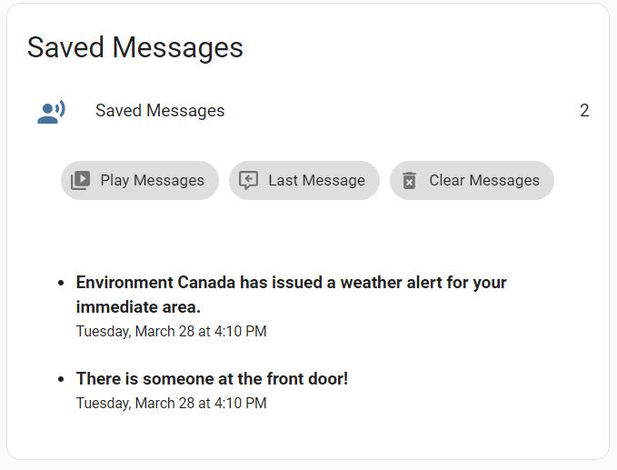

# Play and Save TTS Messages + Message History

## What is this?

This is basically an answering machine (remember those?) for your TTS messages. When you play a TTS message that you want saved under certain conditions (ie. nobody is home), you call the script **TTS Play Message** `script.tts_play_message` instead of calling your tts service (or Alexa notify) directly. The script will decide whether to play the message immediately, or save it based on the conditions you specify. If a tts message that has been saved is repeated a duplicate message is not saved, but the timestamp is updated to the most recent instance.

Messages are played back using the **TTS Play Saved Messages** script `script.tts_play_saved_messages`. Set an appropriate trigger (for example when you arrive home) in the automation **TTS Auto Play Saved Messages** `automation.tts_auto_play_saved_messages` automation to call this script automatically.

Saved messages will survive restarts if Restore On Restart was selected when you created your variable entity.

This default components in this package will also record messages to the file `/config/www/tts_message_history.txt` using the built in [file integration](https://www.home-assistant.io/integrations/file/).

**You must manually create a blank file `/config/www/tts_message_history.txt` and restart Home Assistant after installing this package for tts message history to function.** The `tts_message_history.txt' file can also be \_cleared\* at any time, **but not deleted**. Note that it takes a moment for the last message to be recorded in the history file.

If you don't want to use message history you can delete the indicated sections of code.

The **Play Last Message** function does require message history to work.

## How do I use it?

### 1. Install HASS-Variables Custom Integration

The [HASS-Variables](https://github.com/Wibias/hass-variables) integration is available on HACS. If you're not using HACS I'll assume you know how to install it manually. You must be using at least v3.0.0. You must restart Home Assistant.

### 2. Create a TTS Saved Messages sensor.

Add a Hass-Variables integration sensor variable to your Home Assistant instance with the following option values.

    Type: Create a Sensor Variable
    Variable ID: saved_tts_messages
    Variable Name: Saved TTS Messages
    Icon: mdi:account-voice
    Initial Attributes: <leave blank>
    Intial Value: 0
    Restore on Restart: ON
    Force Update: ON

### 3. Install This Package

The easiest way to utilize this is to install it as a [package](https://www.home-assistant.io/docs/configuration/packages/).

To enable packages in your configuration, create a folder in your config directory named `packages` and add the following line to your `configuration.yaml` file.

    homeassistant:
      packages: /config/packages

If you already have packages enabled in your configuration, simply download [package_save_tts_messages.yaml](package_save_tts_messages.yaml) to your packages directory. Don't forget to restart Home Assistant!

#### Installing Without Packages

To utilize this without installing as a package copy the relevant code and paste in an appropriate place in your `configuration.yaml` file.

### 4. Adjust Package Options For Your Configuration

You must change a few things in the package to work with your configuration. **Look for the #TODO tags!**

- **TTS Service** - The package default is `tts.cloud_say` which is the NabuCasa TTS service. Change these calls to whichever TTS service you use (TTS, Alexa Notify).
- **Media Player** - You must change these to a valid media player entity id in your configuration.
- **Play or Save Condition** - Adjust this condition to decide whether to play or save the TTS message. The TTS message will play immediately and will not be saved when the condition(s) evaluate to true.
- **TTS Auto Play Saved Messages** - Adjust this trigger in this automation to automatically play your saved messages at appropriate times, for example when somebody comes home.
- **TTS Message Timeout** - Adjust this for the longest TTS message you may play or your messages may be cut short. Default is 60 seconds.

### 5. Create or Adjust your TTS Service Calls

Finally, you must create the **TTS Play Message** service calls. Replace your current regular TTS service calls for messages you may want to save when the conditions you have specified are met.

**NORMAL TTS EXAMPLE**

In **your configuration**:

    - service: tts.cloud_say
      target:
        entity_id: media_player.dining_room_hub
      data:
        message: ...

becomes

    - service: script.tts_play_message
      data:
        message: ...

**ALEXA NOTIFY EXAMPLE**

In **this package**, replace any instance of this.

    service: tts.cloud_say
    target:
      entity_id: media_player.dining_room_hub
      data:
        message: ...

With something like this.

    service: notify.alexa_dining_room_hub
    data:
      data:
        type: tts
      message: ...

Don't forget to add the tts data tag when you replace the tts service calls!

**TTS MESSAGE HISTORY**
You must change **all** of your TTS service calls to `script.tts_play_message` if you want them all included in your TTS message history file.

The `skip_save: true` parameter can be used if you want to record a tts message in the history file but not save it.

    - service: tts.play_or_save_message
      target:
        entity_id: media_player.dining_room_hub
      data:
        skip_save: true
        message: ...

### Skip No Messages Notification

The default configuration will play _"There are no messages waiting for you."_ if there are no saved messages when **TTS Play Saved Messages** is called.

If you wish to skip this message you can specify the `skip_none` parameter in a **TTS Play Saved Messages** service call.

    - service: script.tts_play_saved_messages
      data:
        skip_none: true

### Clearing Saved Messages

Saved messages can be cleared without playing them by calling the **TTS Clear Saved Messages** `script.tts_clear_saved_messages` script. This can be used for example if you have read your saved messages in the UI instead of playing them back via TTS (see markdown card example).

## Lovelace Saved Messages Card

See [saved_messages_card.yaml](saved_messages_card.yaml) for an example lovelace card.

## Troubleshooting

If you see this error you forgot to create `/config/www/tts_message_history.txt`

NOTE - You will see the following warning in your Home Assistant Log until the first TTS message is recorded in the history file.

`WARNING (SyncWorker_16) [homeassistant.components.file.sensor] File or data not present at the moment: tts_message_history.txt`
